# Toybox keyboard ビルドガイド

- Toybox keyboardはトラックパッドを搭載可能な分割型65%キーボードキットです。"6", "Y", "G", "B"にあたるキーは左右で重複しています。
- BLE Micro Pro用に単4電池左右それぞれ2本ずつ搭載できます。また、接続状態確認用の青色LEDが1つずつ付いています。

|トラックパッドあり|トラックパッドなし|
|--|--|
|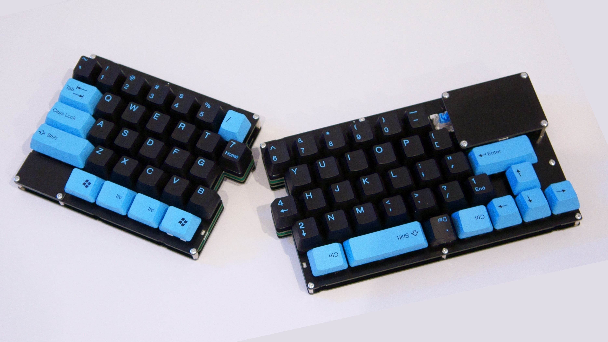|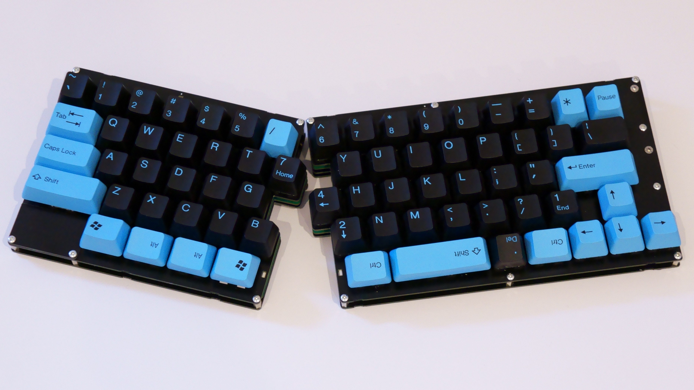|
||
|**電池**|**インジケータ**|
|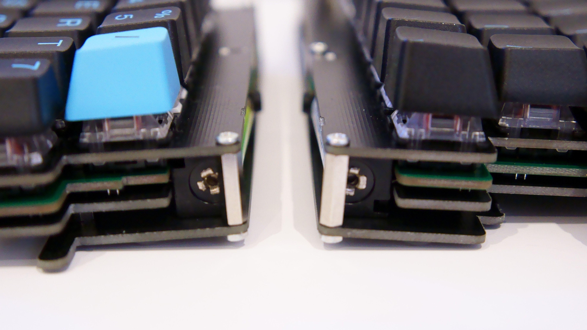|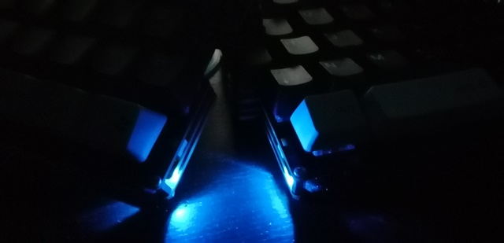|
||
|**レイアウト**||
|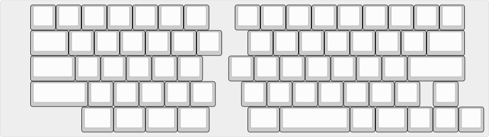||

- 仕様
  - タッチパッド
    - 検出
      - シングルタッチ
      - タップ、ダブルタップ
    - サイズ
      - 基板:60x44[mm]
      - 検出部:50x33[mm]
    - 分解能
      - 576x384
  - 駆動時間
    - BLE Micro Pro、トラックパッド構成で700mAhの電池2本を使用した場合は約700時間
      - 計算値です。実際の駆動時間は利用方法によって異なります
      - スリープモードを使うことで消費電力を抑えることができます
      - トラックパッドを使わない構成では2倍程度になります

- [キット内容品](#キット内容品)
- [キット以外に必要なもの](#キット以外に必要なもの)
  - [部品](#部品)
  - [工具](#工具)
- [組み立て手順](#組み立て手順)
  - [(トラックパッド構成)トラックパッド基板をハンダ付けする](#トラックパッド構成トラックパッド基板をハンダ付けする)
  - [ソケットをハンダ付けする](#ソケットをハンダ付けする)
  - [電池ボックスをハンダ付けする](#電池ボックスをハンダ付けする)
  - [(トラックパッド構成)TRRSジャックをハンダ付けする](#トラックパッド構成trrsジャックをハンダ付けする)
  - [(トラックパッド構成)レベル変換基板をハンダ付けする](#トラックパッド構成レベル変換基板をハンダ付けする)
  - [スタビライザを取り付ける](#スタビライザを取り付ける)
  - [(トラックパッド構成)右実装プレートのスペーサーを取り付ける](#トラックパッド構成右実装プレートのスペーサーを取り付ける)
  - [スライドスイッチ、リセットスイッチを差し込む](#スライドスイッチリセットスイッチを差し込む)
  - [トッププレートの上から実装基板にキースイッチを差し込む](#トッププレートの上から実装基板にキースイッチを差し込む)
  - [スライドスイッチ、リセットスイッチをハンダ付けする](#スライドスイッチリセットスイッチをハンダ付けする)
  - [トッププレート、ボトムプレートをネジ止めする](#トッププレートボトムプレートをネジ止めする)
  - [Pro Micro または BLE Micro Pro を取り付ける](#pro-micro-または-ble-micro-pro-を取り付ける)
  - [Pro Microカバーとボトムプレート2をネジ止めする](#pro-microカバーとボトムプレート2をネジ止めする)
  - [(トラックパッド構成)トラックパッド基板をネジ止めする](#トラックパッド構成トラックパッド基板をネジ止めする)
  - [ゴム足を貼り付ける](#ゴム足を貼り付ける)
  - [キースイッチ、電池を差し込む](#キースイッチ電池を差し込む)
  - [ファームウェアを書き込む](#ファームウェアを書き込む)
    - [BLE Micro Proの場合](#ble-micro-proの場合)
    - [Pro Microの場合(暫定対応)](#pro-microの場合暫定対応)

## キット内容品
|部品|数量|
|--|--|
|トッププレートセット |1
|実装基板セット |1
|ボトムプレートセット |1
|Pro Microカバー |1
|M2x13スペーサー |9
|M2x7スペーサー |14
|M2x4.5スペーサー |4
|M2x3.5スペーサー |4
|M2x5バインドネジ |22
|M2x3なべ小ねじ |9
|M2ナット |15
|単4x1 電池ボックス |4
|タクトスイッチ |2
|スライドスイッチ |2
|TRRSジャック |2
|ゴム足 |10
||
|**トラックパッド構成**
|レベル変換基板 |1
|2.54mmピッチピンヘッダ |1
|ハーフピッチピンヘッダ |1
|トラックパッド基板 |1
|トラックパッド用IC |1
|積層セラミックコンデンサ |1

## キット以外に必要なもの
### 部品
|部品|数量|
|--|--|
|MX互換スイッチ |65~70
|MX用ソケット |65~70
|MX用キーキャップ |65~70
|2Uスタビライザ(PCBマウント) |3
|コンスルー |適量
|TRRSケーブル|1
|USBケーブル|1
||
|**BLE Micro Pro構成の場合**|
|BLE Micro Pro |1~2
|アルカリまたはNi-MH単4電池(公称電圧1.5V-1.2V)|2~4
||
|**Pro Micro構成の場合**|
|Pro Micro |1 

- 作例ではtai-haoの104キーのキーキャップを使用しています

### 工具
- ハンダゴテ
- ドライバー
- ニッパー
- （あったほうが便利）M2ナット用レンチなど

## 組み立て手順

### (トラックパッド構成)トラックパッド基板をハンダ付けする
- IC, コンデンサをハンダ付けします
- 4隅のジャンパをブリッジさせてネジ取り付け用のスルーホールを導通させます
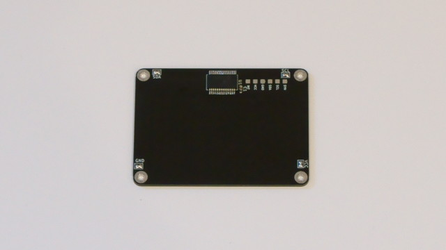

### ソケットをハンダ付けする
- 浮かないようにスイッチ用ソケットを実装基板にハンダ付けする
  - トラックパッド構成の場合は右上の5キー分はハンダ付けしなくても構いません
  - 右手側のPro Micro付近をハンダ付けする際は、スルーホールにハンダが流れ込まないようにマスキングテープなどで塞いでおくことをおすすめします
  - また、コンスルーを取り付けたときにソケットと干渉しないように注意してください
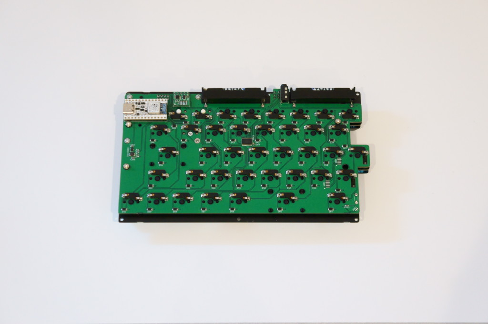

### 電池ボックスをハンダ付けする
- キースイッチを使ってトッププレートを仮止めする
  - 4隅付近の電池ボックス用のスルーホールを塞がない位置にスイッチを差し込んで、トッププレートを仮止めします
  - 組み立てたときのトッププレートと実装基板の距離を再現することが目的なので、トッププレートが実装基板と平行になっていることを確認してください
- 電池ボックスの足を曲げる
  - **左右のキーボードそれぞれで電池の+極同士が向かい合う向き**でボックスを取り付けるので、向きに注意して曲げてください
  - PCBの縁などに押し当てながら曲げるときれいに曲がります
- トッププレートと実装基板に電池ボックスを押し付けながらハンダ付けする
  - 電池ボックスを実装基板裏側からさしこんでハンダ付けします
  - トッププレートと足が干渉する場所はニッパーで切って短くしてください
  - トッププレートとボトムプレート2で電池ボックスをぴったりと挟み込んで保持するので、トッププレートと密着するようにしてください
- 仮止めしたトッププレートを外し、実装基板表側に飛び出た足を切る
  - スイッチを差し込んだときに浮かないように表側に飛び出た足を切ってください

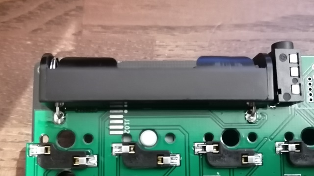

### (トラックパッド構成)TRRSジャックをハンダ付けする
- 浮かないようにTRRSジャックを取り付けます

### (トラックパッド構成)レベル変換基板をハンダ付けする
- 2種類のピンヘッダを使ってレベル変換基板を実装基板にハンダ付けします
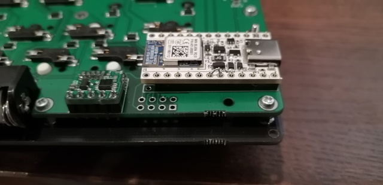

### スタビライザを取り付ける
- 実装基板にスタビライザを取り付けます

### (トラックパッド構成)右実装プレートのスペーサーを取り付ける
- M2のなべ小ねじで3.5mmのスペーサーを右実装基板にネジ止めします

### スライドスイッチ、リセットスイッチを差し込む
- トッププレートの穴の位置と合わせるためにこの手順ではまだハンダ付けしないでください

### トッププレートの上から実装基板にキースイッチを差し込む
- alpha版はスタビライザの穴が若干きついです

### スライドスイッチ、リセットスイッチをハンダ付けする
- リセットスイッチが基板の縁に引っかかって押しっぱなしになっていないこと、スライドスイッチがONOFFできることを確認して、これらのスイッチをハンダ付けしてください

### トッププレート、ボトムプレートをネジ止めする
- 下の図を参考にプレートをネジ止めしてください
- Pro Microカバーの部分はまだネジ止めしないでください
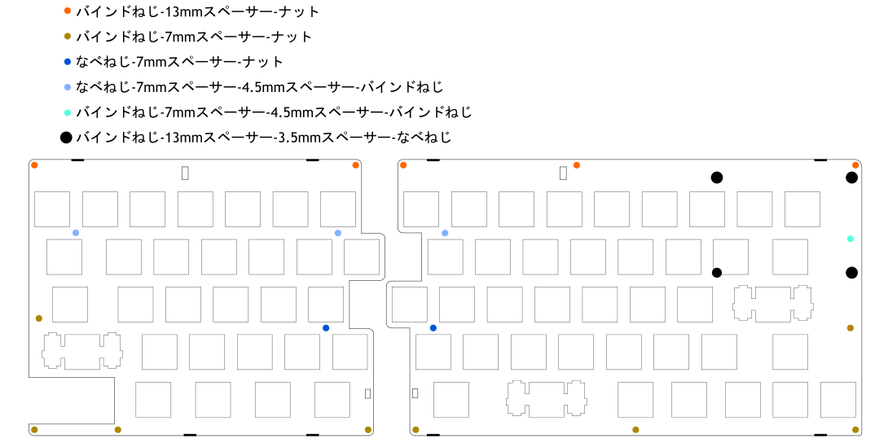

### Pro Micro または BLE Micro Pro を取り付ける
- 1台構成の場合は左右のどちらに取り付けても動作します 
  - BLE Micro Proを使う場合はコンスルーをUSBコネクタ側に寄せてください
- alpha版かつBLE Micro Proの電池残量測定機能を使う場合、19番ピンと20番ピンをショートさせてください
  - 画像の例ではダイオードの足を折り曲げて穴に差し込んでいます

  |左手側|右手側|
  |--|--|
  |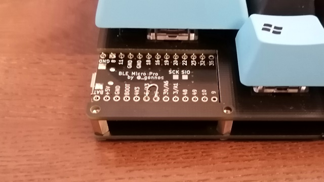||

### Pro Microカバーとボトムプレート2をネジ止めする
- 脱落防止のために電池ボックスカバーの裏側にゴム足を貼り付ける
- コンスルーの高さの都合上Pro Microカバーの上部は若干浮きます

### (トラックパッド構成)トラックパッド基板をネジ止めする
- 13mmのスペーサーをトッププレートに取り付け、その上にトラックパッド基板をネジ止めします
- 上下の向きに注意して、トラックパッド用ICが基板裏面上部に来る向きで取り付けてください 
  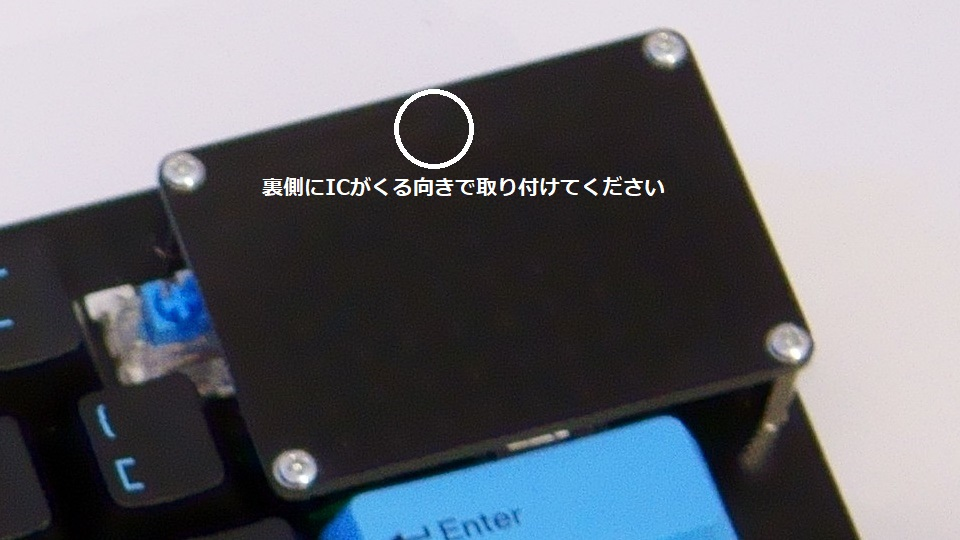

### ゴム足を貼り付ける
- キーボードの裏側4箇所ずつにゴム足を貼り付けます
- ボトムプレート2の下半分の位置につけると机とネジが接触しないようにできるはずです

### キースイッチ、電池を差し込む
- BLE Micro Pro 1台で動かす場合はボードを付ける側のみに電池を入れるだけでも動きます
  - 左右両方にとりつけるとより長持ちします 

ハードウェアは以上で完成です

### ファームウェアを書き込む

#### BLE Micro Proの場合
- BLE Micro Pro WebConfiguratorからファームウェアを書き込んでQMK Configuratorからキーマップを設定してください
  - 完全無線構成かつトラックパッド構成の場合は右手側をマスターにしてください
  - BLE Micro Proをスリープ状態から復帰させるにはBLE Micro Proを取り付けた側の5列目のスイッチのいずれかを押してくだい
  - 2台構成の場合はマスターのみ電源ON状態にしてTRRSケーブルで左右を接続することで部分無線構成として使うこともできます

#### Pro Microの場合(暫定対応)
- QMK公式にはマージされていません。[こちらのフォーク](https://github.com/sekigon-gonnoc/qmk_firmware/tree/dev/ble_micro_pro)からソースコードを取得してビルド、書き込みしてください                    
  ```
    make toybox/pm:default:flash
  ```